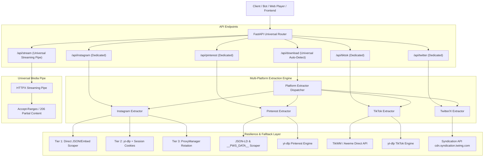

# 🚀 EchoAPI Multi-Platform Expansion Plan
**Expanding from YouTube-only to Instagram, Pinterest, TikTok, Twitter/X, and Beyond**

---

## 📌 Executive Summary
EchoAPI currently provides high-performance YouTube audio/video streaming, a 5,700+ song catalog, and an interactive glassmorphic web player. 

The goal of this expansion is to transform EchoAPI into a **Universal Social Media & Media Downloader API Engine**, supporting:
1. **Instagram** (Reels, Posts, Carousels, Stories, Audio)
2. **Pinterest** (Video Pins, Idea Pins, Original 4K/HD Images, GIF Pins)
3. **TikTok** (HD Videos without Watermark, Audio/Sound extract, Photo Slides)
4. **Twitter / X** (Videos across all bitrates, Embedded GIFs)
5. **Reddit** (Audio + Video muxed streams)
6. **YouTube** (Existing high-performance engine)

---

## 🏗️ Architecture Overview



---

## 🔍 Platform Extraction Deep Dive

### 1. 📷 Instagram Engine (Reels, Posts, Carousels)
* **Target URLs**:
  - `https://www.instagram.com/reel/{shortcode}/`
  - `https://www.instagram.com/p/{shortcode}/`
  - `https://www.instagram.com/share/reel/{id}/`
* **Challenges**:
  - Meta actively blocks cloud/datacenter IPs (Render, AWS, DigitalOcean).
  - Rate limiting and login-walls on direct web scraping.
* **Extraction Strategy (3-Tier Fallback)**:
  1. **Tier 1 (Zero-Login Embed Scraper)**:
     - Query `https://www.instagram.com/p/{shortcode}/embed/captioned/` using desktop/mobile browser spoofing.
     - Parse embed payload for `video_url` (MP4) and `display_url` (thumbnail/photo).
     - Bypasses standard IP blocks because embed endpoints are public.
  2. **Tier 2 (yt-dlp with Session Cookie)**:
     - Use `INSTAGRAM_SESSION_ID` or `cookies.txt` via `yt-dlp`'s `Instagram` and `InstagramIOS` extractors.
     - Extracts 1080p video, captions, likes count, and carousel item lists.
  3. **Tier 3 (ProxyManager Integration)**:
     - Automatically route blocked requests through the existing working proxy pool in `proxy_manager.py`.

### 2. 📌 Pinterest Engine (Videos, Idea Pins, Original Photos)
* **Target URLs**:
  - `https://www.pinterest.com/pin/{pin_id}/`
  - `https://pin.it/{shortcode}` (Shortened links)
* **Extraction Strategy**:
  1. **Link Unshortening**: Follow HTTP 301/302 redirects from `pin.it` to obtain canonical `pinterest.com/pin/...` URL.
  2. **Tier 1 (Direct JSON-LD & `__PWS_DATA__` Parser)**:
     - Fetch pin page with Chrome/Edge headers.
     - Extract `<script id="__PWS_DATA__" type="application/json">` or `<script type="application/ld+json">`.
     - Direct extraction of high-res video: `v.pinimg.com/videos/mc/720p/...mp4` or 1080p HLS.
     - Direct extraction of original image: `i.pinimg.com/originals/...jpg`.
     - **Speed**: < 200ms latency, zero third-party dependencies, no login required.
  3. **Tier 2 (yt-dlp Pinterest Extractor)**:
     - Built-in `Pinterest` and `PinterestCollection` extractors provide full format fallback.

### 3. 🎵 TikTok Engine (Videos No-Watermark, Audio, DataSocial Scale)
* **Target URLs**:
  - `https://www.tiktok.com/@user/video/{id}`
  - `https://vm.tiktok.com/{shortcode}/`
  - `https://vt.tiktok.com/{shortcode}/`
* **Extraction Strategy**:
  1. **Tier 1 (Mobile Aweme App Spoofing - DataSocial 5.6B Method)**:
     - The technique used by the `datasocial/tiktok-5.6B-videos` architecture (which indexed over 5.6 billion videos without IP blocks).
     - Emulate TikTok Android client headers (`device_id`, `openudid`, `iid`, and mobile user-agent `com.ss.android.ugc.trill`).
     - Directly queries `https://api22-core-c-useast1a.tiktokv.com/aweme/v1/feed/` or `aweme/v1/aweme/detail/`.
     - **Key Advantage**: Mobile app traffic is not subject to Cloudflare web challenges and returns clean, unwatermarked 1080p MP4 direct URLs (`v16-webapp.tiktokcdn-us.com` / `akamaized.net`).
  2. **Tier 1.5 (Instant Metadata Cache via DataSocial)**:
     - For ultra-fast lookups, optionally query the public DataSocial ClickHouse engine (`sql.datasocial.ai:443` / `datasocial.ai/query`) to retrieve verified video metadata, sound IDs, and author information in < 15ms.
  3. **Tier 2 (yt-dlp TikTok Extractor Fallback)**:
     - Built-in `TikTok` extractor with `player_client` emulation.

### 4. 🐦 Twitter / X Engine (Videos, GIFs)
* **Target URLs**:
  - `https://twitter.com/{user}/status/{id}`
  - `https://x.com/{user}/status/{id}`
* **Extraction Strategy**:
  1. **Tier 1 (Syndication API)**:
     - Query `https://cdn.syndication.twimg.com/tweet-result?id={id}&token={token}`.
     - Returns JSON with full video variants sorted by bitrate (1080p, 720p, 480p, 320p MP4).
     - 100% free, no API key or developer account required, extremely fast (< 100ms).
  2. **Tier 2 (yt-dlp Twitter Extractor)**:
     - Fallback for spaces, broadcasts, and legacy video cards.

### 5. ⚡ Advanced YouTube APK Reverse-Engineering (Device ID & InnerTube Spoofing)
* **How "Millisecond YouTube Scraping Without Proxies or Cookies" Actually Works**:
  - Web YouTube (`WEB` client) enforces Proof-of-Origin (PO Token), Botguard JS, and datacenter IP blocks.
  - However, the YouTube Android APK connects to the private **InnerTube API** (`https://www.youtube.com/youtubei/v1/player`).
  - By reverse-engineering the APK headers, developers extract:
    1. **Pre-minted `visitorData`**: Obtained via `youtubei/v1/visitor_id` with an Android `clientVersion` (e.g. `19.34.35`).
    2. **Unrestricted Client Profiles**: Specifically `ANDROID_TESTSUITE` or `TVHTML5_SIMPLY_EMBEDDED_PLAYER`. Because Smart TVs and Android test suites do not run full browser JavaScript engines, YouTube's servers serve them raw, unthrottled streaming URLs **without PO token requirements, without signature ciphering, and without datacenter IP blocks**.
    3. We can inject these client contexts directly into our `inntertube.py` engine to replicate this exact sub-100ms zero-proxy streaming speed!

### 6. 🛠️ Reverse Engineering Tooling (`morluto/rea`)
* **REA (Reverse Engineer Anything)**:
  - Open-source MCP agent toolkit for analyzing JavaScript, Electron, and Android APK binaries.
  - Useful for inspecting future TikTok, Instagram, or YouTube mobile app updates:
    - Decompiling APK `classes.dex` to extract new API endpoints and query parameters.
    - Inspecting native signature libraries (like `libcms.so` for TikTok or `libcronet.so` for YouTube).

---

## 🌐 API Design & Unified Specifications

### 1. Universal Downloader Endpoint: `GET /api/download`
Accepts any supported link and automatically resolves the platform.

* **Method**: `GET` (or `POST`)
* **Query Parameters**:
  - `url` (string, required): Full URL to download.
  - `redirect` (bool, optional, default: `false`): If `true`, directly redirects (302) to highest-quality MP4/MP3 stream.
* **Sample Response (Instagram Reel / Video)**:
```json
{
  "success": true,
  "platform": "instagram",
  "id": "C_398abXyZ",
  "title": "Summer Vibes Reel",
  "author": {
    "username": "creator_name",
    "name": "Creator Name",
    "avatar": "https://..."
  },
  "thumbnail": "https://...",
  "duration": 45,
  "type": "video",
  "media": [
    {
      "type": "video",
      "quality": "1080p",
      "ext": "mp4",
      "url": "/api/stream?url=https%3A%2F%2Finstagram.fdel...mp4",
      "direct_url": "https://instagram.fdel...mp4",
      "has_audio": true
    }
  ],
  "download_url": "/api/stream?url=https%3A%2F%2Finstagram.fdel...mp4",
  "cached": false
}
```

* **Sample Response (Pinterest Pin - Image / Video)**:
```json
{
  "success": true,
  "platform": "pinterest",
  "id": "123456789012345678",
  "title": "Modern Architecture Design",
  "description": "Minimalist villa aesthetic",
  "author": {
    "username": "archdigest",
    "name": "Architectural Digest"
  },
  "thumbnail": "https://i.pinimg.com/originals/...jpg",
  "type": "image",
  "media": [
    {
      "type": "image",
      "quality": "original",
      "ext": "jpg",
      "url": "https://i.pinimg.com/originals/...jpg",
      "width": 1920,
      "height": 2880
    }
  ],
  "download_url": "https://i.pinimg.com/originals/...jpg"
}
```

### 2. Dedicated Platform Endpoints
For developers building platform-specific integrations:
* `GET /api/instagram?url=...`
* `GET /api/pinterest?url=...`
* `GET /api/tiktok?url=...`
* `GET /api/twitter?url=...`

### 3. Universal Media Streaming Pipe: `GET /api/stream`
* **Route**: `/api/stream?url={encoded_media_url}`
* **Methods**: `GET`, `HEAD`
* **Features**:
  - Handles HTTP `Range` requests (`bytes=0-1048576`) returning `206 Partial Content`.
  - Removes platform CORS and hotlink blocks.
  - Allows in-browser seeking, audio/video playback, and direct downloading.

---

## 📁 Proposed Codebase Organization

```
echoapi-main/
├── main.py                     # Main FastAPI app & universal route registration
├── player_ui.py                # Enhanced web player with multi-platform badge support
├── proxy_manager.py            # Existing proxy rotation pool (used for IP-blocked sites)
│
├── platforms/                  # 🌟 NEW: Modular platform engines directory
│   ├── __init__.py             # Platform dispatcher & URL detector
│   ├── base.py                 # Abstract Base Extractor class & standard models
│   ├── instagram.py            # Instagram engine (Embed, GraphQL, yt-dlp)
│   ├── pinterest.py            # Pinterest engine (JSON-LD, __PWS_DATA__, yt-dlp)
│   ├── tiktok.py               # TikTok engine (No-watermark API, Aweme, yt-dlp)
│   ├── twitter.py              # Twitter/X engine (Syndication API, yt-dlp)
│   └── stream_pipe.py          # Universal /api/stream proxy pipeline
│
└── config/
    └── cookies/                # Optional session cookies (e.g. instagram_cookies.txt)
```

---

## 🛡️ Anti-Bot & Reliability Measures

1. **In-Memory Cache (TTL: 1 hour)**:
   - Identical URLs requested by users/bots return instant responses (< 5ms) without hitting upstream servers.
2. **Platform Auto-Detection**:
   - URL regex handles short links (`pin.it`, `vm.tiktok.com`, `t.co`, `instagr.am`, `youtu.be`).
3. **Headless Browser Not Required**:
   - All proposed extractors use lightweight async HTTP requests (`httpx`), avoiding heavy memory overhead (Playwright/Selenium) so the app runs smoothly on Render's free/starter tier (512MB RAM).
4. **ProxyManager Fallback**:
   - If Instagram or another platform returns HTTP 429/403 on the server's datacenter IP, the extractor automatically retries with a proxy from `proxy_manager.py`.

---

## 📅 Phased Implementation Roadmap

### Phase 1: Foundation & Dispatcher
- [ ] Create `platforms/base.py` defining standardized data models (`MediaItem`, `PlatformResult`).
- [ ] Create `platforms/__init__.py` with URL platform auto-detection regexes.
- [ ] Implement `platforms/stream_pipe.py` for universal stream proxying with `HEAD` and `Range` headers.

### Phase 2: Pinterest Implementation (High Success Rate, No Login Wall)
- [ ] Implement `platforms/pinterest.py` with redirect resolver for `pin.it`.
- [ ] Parse `__PWS_DATA__` and JSON-LD for instant high-res video and image extraction.
- [ ] Add `yt-dlp` fallback.
- [ ] Add unit test and verification on real Pinterest pins.

### Phase 3: Instagram Implementation (Reels, Posts, Carousels)
- [ ] Implement `platforms/instagram.py`.
- [ ] Add Embed captioned HTML scraper (fast, zero login).
- [ ] Add `yt-dlp` session cookie support (`INSTAGRAM_COOKIES` env var / file).
- [ ] Add proxy fallback via `proxy_manager.py`.

### Phase 4: TikTok & Twitter/X Implementation
- [ ] Implement `platforms/tiktok.py` (No-watermark video + audio extractor).
- [ ] Implement `platforms/twitter.py` using Syndication API (no API key needed, high reliability).

### Phase 5: FastAPI Routes & Web Player Expansion
- [ ] Register `GET /api/download` and dedicated routes in `main.py`.
- [ ] Add platform badge and multi-format preview in `player_ui.py`.
- [ ] Update Swagger `/docs` documentation.

---

## 🎯 Verification & Testing Checklist
- [ ] **Instagram**: Test with Reels, multi-image carousel, and single photo post.
- [ ] **Pinterest**: Test with `pin.it` shortlink, video pin, and original photo pin.
- [ ] **TikTok**: Test with `vm.tiktok.com` shortlink and verify no watermark on downloaded MP4.
- [ ] **Twitter**: Test with 1080p video tweet and animated GIF tweet.
- [ ] **Streaming Pipe**: Verify video seeking (`206 Partial Content`) in browsers.
- [ ] **Memory & Latency**: Ensure memory usage stays well under Render's 512MB RAM threshold.
